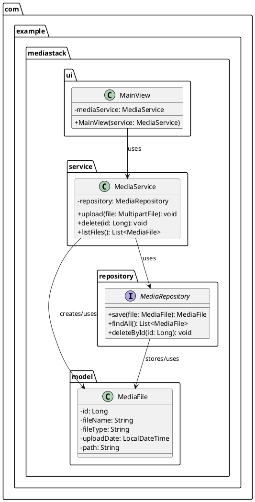

# 📦 MediaStack

**MediaStack** is a personal web application for managing and displaying your media content.  
It allows uploading, storing, viewing, and deleting **images**, **videos**, and **PDFs** through an intuitive user interface written entirely in Java (Vaadin).  
Data is managed locally using an SQLite database, while the actual files are stored in the local file system.

---

## 📚 Overview

- [Features](#-features)
- [Local Setup](#-local-setup)
- [Tech Stack](#-tech-stack)
- [Project Structure](#-project-structure-v-01)
- [Screenshots](#-screenshots)

---

## 🚀 Features

- 🔼 Upload images, videos, and PDF files
- 📂 Overview of all stored media
- 🖼️ Display images directly in the browser
- 📄 Embed PDF files in the browser
- 🎬 Play videos
- 🗑️ Delete files via the UI
- 🏷️ Store metadata such as filename, type, and upload timestamp

---

## ⚙️ Tech Stack

| Technology  | Purpose                            |
|-------------|-------------------------------------|
| Java 23     | Programming language                |
| Vaadin 24   | UI framework (Java-based)           |
| Spring Boot | Backend framework & configuration   |
| SQLite      | Database for metadata               |
| File-System | Storage for media files             |

---

## 📁 Project Structure (v 0.1)

### Folder Structure

```text
mediastack/
├── src/
│   ├── main/
│   │   ├── java/com/example/mediastack/
│   │   │   ├── ui/       
│   │   │   ├── model/        
│   │   │   ├── repository/    
│   │   │   └── service/
```

### Class Diagram




---

## 🧪 Local Setup

### ✅ Prerequisites

- Java 17+
- Maven
- (Optional: IDE like IntelliJ or VS Code)

### ▶️ Run the project

```bash
git clone https://github.com/your-user/mediastack.git
cd mediastack
mvn spring-boot:run
```

The application will be available at [http://localhost:8080](http://localhost:8080).

---

## 📸 Screenshots

TODO

---
